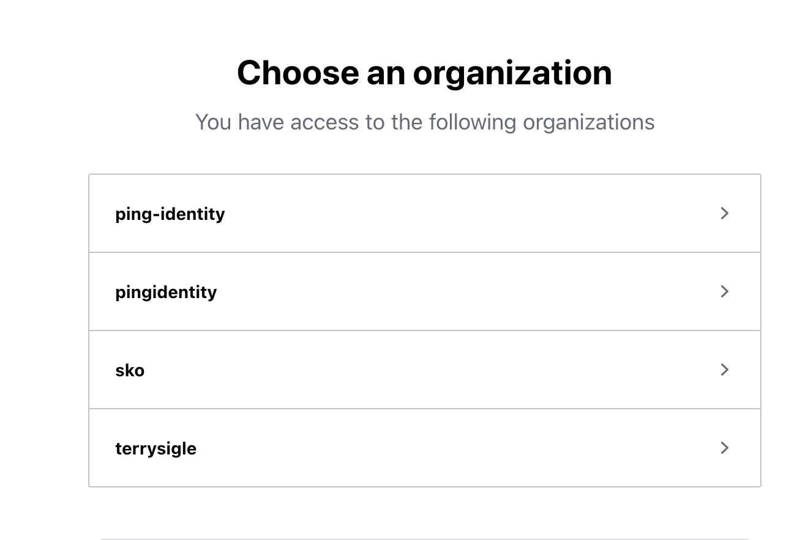
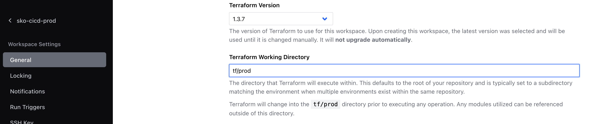
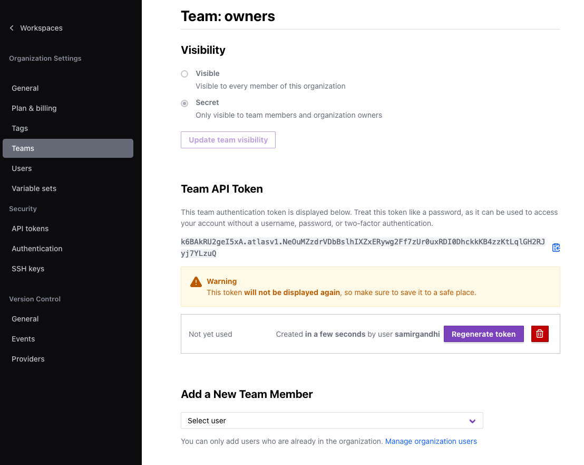
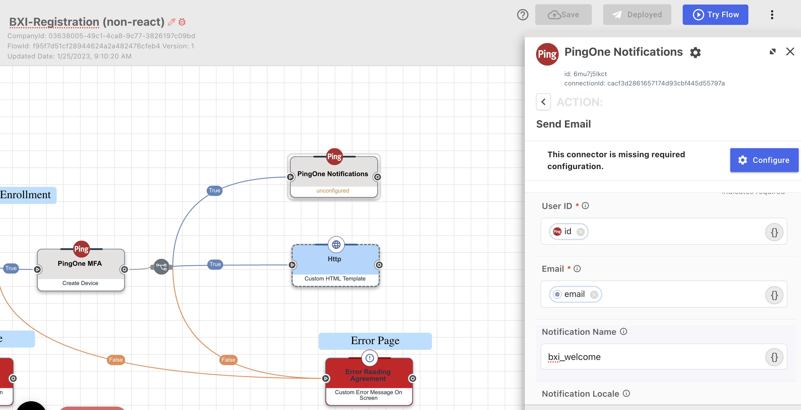

# SKO 2023 - Terraforming PingOne, Part 1: The Bifrost to a Better Realm

In this lab we will simulate scenarios PingOne consumers may encounter.

Functionally this repos is a template that is prepared to:
- Deploy PingOne configuration needed for BXIndustry instances
- Generate the env file needed to map BXI in Glitch to PingOne
- Show SDLC for Davinci Flows:
  - Edit a Davinci Flow in a "dev" instance, and promote it to a "prod" instance with Github Actions

## Prerequisites

To fully experience this Lab:
- Have a [PingOne organization](https://www.pingidentity.com/en/try-ping.html) with:
  - a worker app
  - Davinci added to the admin environment (or at least the DV connection and IDP used for SSO)
  - a user in the admin environment with required roles
  > NOTE: all of this can be set up via https://flows.pingidentity.cloud/sko-setup
- [terraform cli](https://developer.hashicorp.com/terraform/tutorials/aws-get-started/install-cli)
- [gh cli](https://cli.github.com/manual/installation) (commonly `brew install gh`) installed and [auth'd](https://cli.github.com/manual/gh_auth_login)
- [terraform cloud free account](https://app.terraform.io/public/signup/account) - This is used to deploy the "prod" env from CI/CD

## Lab Overview

- Project Base Setup
- Deploy "dev" env
- :rocket: Deploy "prod" env
- Build a feature in "dev"
- Open Pull Request
- Merge Pull Request to deploy "prod"

## Project Base Setup
Click "Use this template" :wink:
On the next screen be sure to click "include all branches". Then name the `sko-tf-bifrost`

The repo will be created in your Github account. 

```
cd ~/projects
mkdir -p terraform
git clone <repo-url>
```

```
cd sko-tf-bifrost
```

First we need to set up variables. There is a variable template file `secrets` (ha, you really thought I committed my secrets to git huh?). Copy this file to `localvars` <- this name is actually important.

```
cp secrets localvars
```

Then fill them in! Hint: you should have most of these handy from the Terraform packages session.

You're now ready to deploy dev!

## Deploy Dev

From the root of the repo (e.g. `sko-tf-bifrost` folder):

```
source localvars
terraform -chdir=tf/dev init
terraform -chdir=tf/dev apply
```

Feel free to look at the plan, then enter `Yes`. 

Dev should deploy in ~50s. 

If you want.. you can stop here and just play around in Dev skip to [Build a Feature](#build-a-feature)


## Deploy Prod

Before deploying prod, you need a workspace in Terraform cloud. This environment is going to be deployed from the cli, but the workload happens in Terraform cloud.

- Sign in at: https://app.terraform.io/session



### Prod TF Cloud workspace setup.

- make sure you have an organization. Get that organization name create a workspace:
  - Click Projects & workspaces to view a list of the workspaces within your organization.
  - Click New, then select Workspace from the dropdown menu.
  - Choose workflow type CLI-driven
  - Name workspace sko-cicd-prod
- From the workspace overview page. Go to Settings -> General -> Terraform Working Directory. 
    - Enter `tf/prod`


Almost done..

Now, make an api key. 
Click on your organization in the bottom left to go to the home page.
Then settings then teams.



Finally, upload your secrets to Github so they can be used by the pipeline. 

```
./uploadSecrets.sh
```

It will ask you to enter your api key. If you mess up, run the script again. 
> Note this uploads the localvars file to github, be sure it's filled out. 

### Actually Deploy Prod

```
terraform -chdir=tf/dev init
sleep 30
terraform -chdir=tf/dev apply
```

## Set up Glitch

Remix `https://demo.bxindustry.org/company`
Give your new project a name, maybe sko-cicd-dev.

From the root of the repo run:

```
./makeEnv.sh -e dev
```

This outpus a set of environment variables.. that looks like a file..
Copy them into the .env file on your dev glitch project!
There is a plaintext button to directly copy it all in. 

If you set up prod, run the steps again replacing `dev` with `prod`

## Build a Feature

Log in to PingOne with the user on your localvars file. 
You can now see your deployed environments in your PingOne console.
(you may need to refresh your browser page)

For the lab, we'll build an email notification for Davinci. 
Feel free to build whatever you want, just remember every **thing** you build. 


### Make Notification Template in PingOne

Go to the dev environment (should be `sko-cicd-dev`)
Click Experiences -> Notification Templates -> `+` -> Type: `General` Name: `bxi_welcome`
Scroll to email section:
body    = "You have successfully registered!"
subject = "BXI Registration Complete"

### Use Notification in Davinci

Get into your corresponding dev davinci instance. 

Create a new "PingOne Notifications" connection. Accept the default name.

Then open the Registration Flow. 

At the very end, add an additional success branch that sends the email notification: 



User ID: 
click {} -> find "Create PingOne User" (4 from the bottom) -> find `id` about 2/3 down.

Email:
click {} -> find Http "Registration Form" (3 from bottom) -> in output find `email`.

Notification Name: 
`bxi_welcome`

Apply, Save, Deploy. 

### Test the feature

Go to your glitch project and click Preview and Open in New Window. 
Go through registration, with an accessible email. 
At the end.. you should get a welcome email. YaY!

### Prepare for promotion

To get this into prod, create a "code version" of everything we built manually. 
Sounds hard. Surprisingly isn't.

For proper SDLC, make a feature branch:

```
git checkout -b bxi-notif
```

### Optionally, cheat

The outcome of above are saved in another branch. you can pull those files into your dev branch. 

```
git checkout devupdate -- tf
```

```
git status
```

should show updates to two files

## Promote


## Terraformer

`cd` to the `terraformer` folder: 

```
source localvars
cd terraformer
./terraformer-pingonedavinci-darwin-amd64 import pingonedavinci -r "*" -C=true --path-pattern generated/davinci/ -t <your-env-id>
```

Now you've pulled your whole terraform env to local. 
To prove it: 

```
cd generated/davinci
terraform init
terraform apply
```

It should say there is nothing to do! whaaaaa